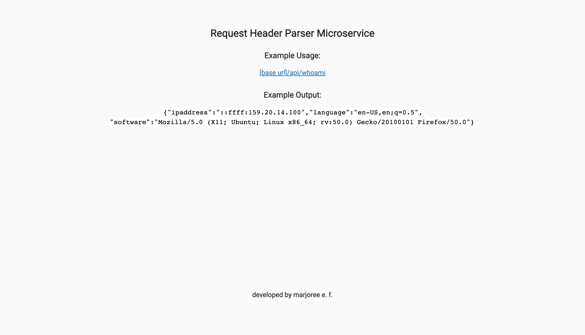
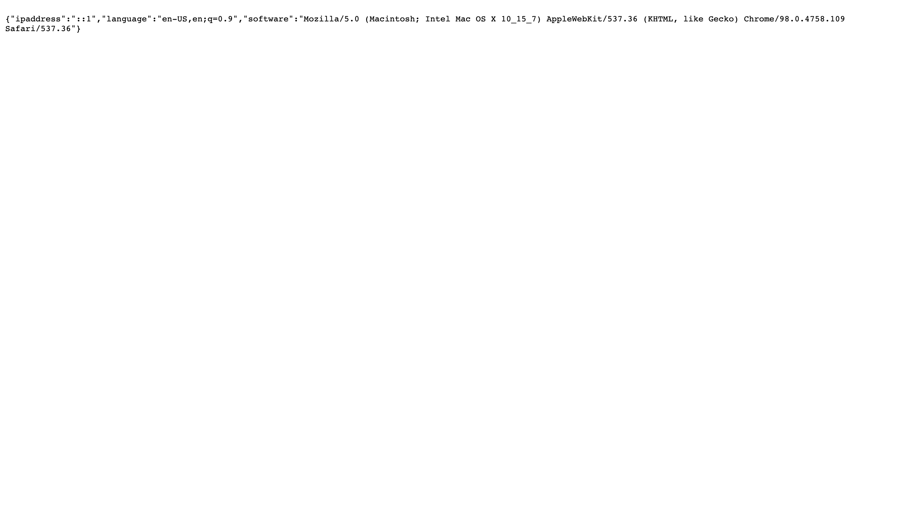

# [Request Header Parser Microservice](https://www.freecodecamp.org/learn/apis-and-microservices/apis-and-microservices-projects/request-header-parser-microservice)
Challenge by freeCodeCamp intended to demonstrate backend knowledge on serving various types of data. Primarily developed using JavaScript.

## Table of contents

- [Overview](#overview)
  - [The challenge](#the-challenge)
  - [Screenshot](#screenshot)
  - [Links](#links)
- [My process](#my-process)
  - [Built with](#built-with)
  - [What I learned](#what-i-learned)
  - [Continued development](#continued-development)
  - [Useful resources](#useful-resources)
- [Author](#author)
- [Acknowledgments](#acknowledgments)

## Overview
Build a full stack JavaScript app that is functionally similar to this:  [Example](https://request-header-parser-microservice.freecodecamp.rocks/). Working on this project will involve you writing your code using one of the following methods:

-Clone this GitHub repo and complete your project locally.
-Use our Replit starter project to complete your project.
-Use a site builder of your choice to complete the project. Be sure to incorporate all the files from our GitHub repo.

### The challenge

Users should be able to:

- A request to /api/whoami should return a JSON object with your IP address in the ipaddress key.
- A request to /api/whoami should return a JSON object with your preferred language in the language key.
- A request to /api/whoami should return a JSON object with your software in the software key.

### Screenshot


Result 1


### Links

- [Solution URL](https://github.com/mfargas/headerparser.git)
- [Live Site URL](https://margie-headerparser.herokuapp.com/)

## My process

### Built with

- Semantic HTML5 markup
- CSS custom properties
- JavaScript with a Backend Approach
- [Node.js](https://nodejs.org/en/) - JS Runtime
- [Express.js](http://expressjs.com/) - Node.js Framework


### What I learned

```
  let ipaddress = req.ip;
  let lan = req.get('Accept-Language');
  let sw = req.get('User-Agent');
```

### Continued development
### Useful resources
- [req.ip](http://expressjs.com/en/5x/api.html#req.ip) - 
- [req.get(field)](http://expressjs.com/en/5x/api.html#req.acceptsLanguages) -

## Author

- Website - [Marjoree E.F.](https://www.marjoree.com)
- Frontend Mentor - [@mfargas](https://www.frontendmentor.io/profile/mfargas)
- FreeCodeCamp - [@marjoreef](https://www.freecodecamp.org/marjoreef)
- Twitter - [@marjoree_js](https://www.twitter.com/yourusername)

<!-- ## Acknowledgments -->